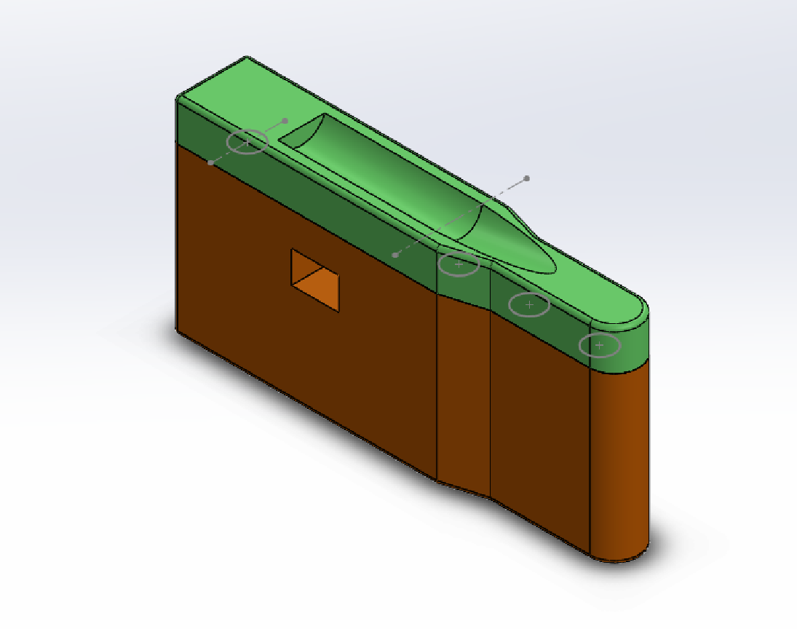
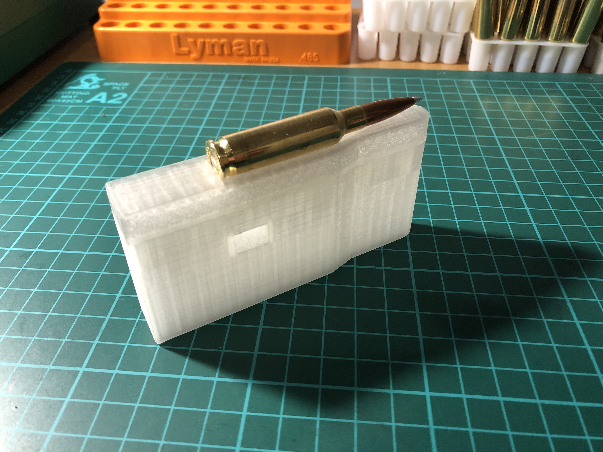
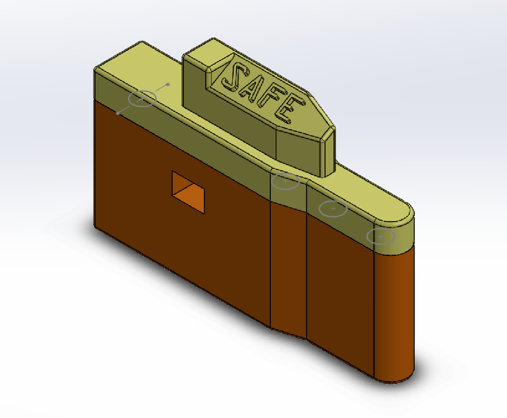

3D Printed Desert Tech SRS Magazine Block
=========================================

Short Action Single Feed Platform
---------------------------------
The single feed platform is designed to single feed your Desert Tech SRS rifle with short action cartridge in F-Class match. Simply locks in place like a standard magazine without extruding out of the magazine well.

"Bolt Stopper" Safety Magazine Block
------------
The bolt stopper will blocks the rifle from firing by locking the bolt back. Locks in like a standard magazine.

